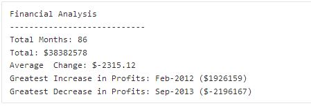

# Py Me Up, Charlie

## PyBank

### Purpose:
Create a Python script for analyzing the financial records of a given company.
The script should be able to analyze the records to calculate each of the following:

-	The total number of months included in the dataset
-	The net total amount of "Profit/Losses" over the entire period
-	The average of the changes in "Profit/Losses" over the entire period
-	The greatest increase in profits (date and amount) over the entire period
-	The greatest decrease in losses (date and amount) over the entire period

### Process:
Utilizing VS Code I was able to write a script in Python that fulfilled all of the above requirements.

### Results:

## PyPoll

### Purpose:
Use programming knowledge to help a small, rural town modernize its vote counting process from a given set of poll data.

The Python script will analyze the votes and calculate each of the following:
-  The total number of votes cast
-  A complete list of candidates who received votes
-  The percentage of votes each candidate won
-  The total number of votes each candidate won
-  The winner of the election based on popular vote.

### Process:
Utilizing VS Code I was able to write a script in Python that fulfilled all of the above requirements.

### Results:

